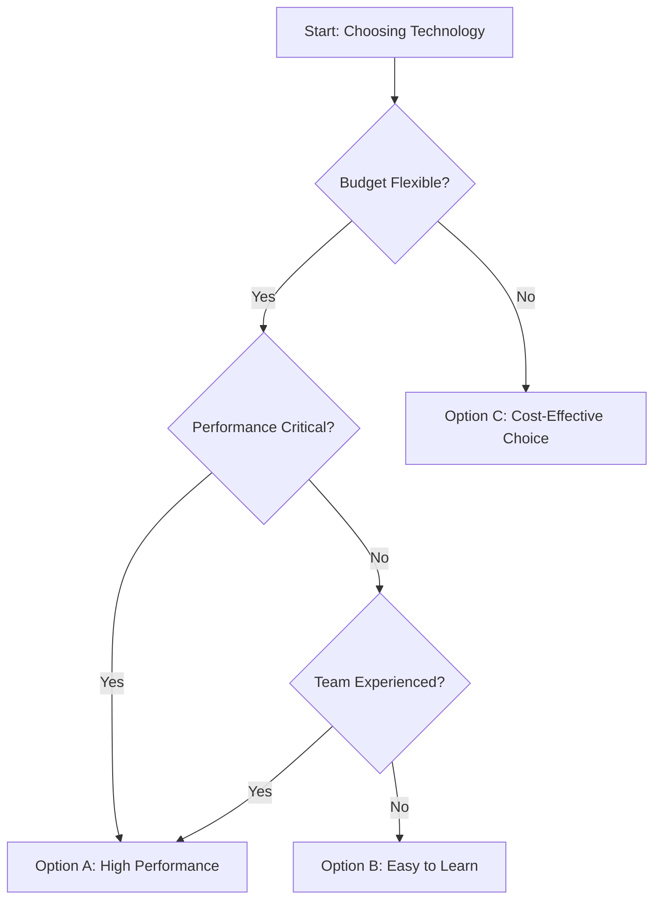

# Comparison Matrix - Technology Alternative Analysis

<critical>The workflow execution engine is governed by: {project-root}/bmad/core/tasks/workflow.xml</critical>
<critical>You MUST have already loaded and processed: {project-root}/bmad/stack-advisor/workflows/comparison-matrix/workflow.yaml</critical>
<critical>Communicate in {communication_language} throughout the comparison process</critical>

<workflow>

<step n="1" goal="Initialize document and understand comparison need">
<action>Write the template to {default_output_file} with all placeholders</action>

<action>Welcome {user_name} to the Comparison Matrix workflow</action>

<action>Explain Dana's role and this workflow's purpose:
"I'm here to help you make data-driven technology decisions. We'll create a structured comparison of your alternatives, weighing them against criteria that matter for your project. This is analytical and objective - my job is to present the facts and trade-offs clearly so you can make an informed choice."
</action>

<action>Ask {user_name} what they need to compare:
- Which technology category? (Frontend framework, Backend framework, Database, Hosting, etc.)
- Which specific options are you considering? (List 2-5 alternatives)
- Do you already have a preferred option, or are you starting from scratch?
- What's the context for this decision? (New project, migration, replacement, etc.)
</action>

<action>Load available context documents:
- Technology selections: {output_folder}/stack-advisor/tech-selections-*.md
- Intake session results: {output_folder}/stack-advisor/intake-session-*.md
- Constraint filter results: {output_folder}/stack-advisor/constraint-filter-*.md
- Architecture blueprint if available
</action>

<action if="context found">Review context to understand:
- Project requirements and constraints
- Business scale ({smb_scale_level})
- Team capabilities
- Technical requirements
- Budget and timeline constraints
</action>
</step>

<step n="2" goal="Define comparison criteria and weighting">
<action>Collaborate with {user_name} to identify evaluation criteria that matter for this specific decision</action>

<action>Suggest standard criteria categories based on technology type:

**Common Criteria for Most Technologies:**
- **Maturity & Stability**: How proven and stable is it?
- **Community & Ecosystem**: Size of community, available libraries/plugins
- **Documentation Quality**: How good are the docs and learning resources?
- **Learning Curve**: How easy is it to learn and use?
- **Performance**: Speed, efficiency, resource usage
- **Maintenance & Updates**: Frequency of updates, security patches
- **SMB Fit**: Appropriate for {smb_scale_level} scale (not over-engineered)
- **Team Fit**: Match with existing team skills
- **Cost**: Licensing, hosting, third-party service costs
- **Migration Effort**: If replacing existing tech, how hard to migrate?

**Frontend-Specific:**
- Bundle size
- Rendering performance
- SEO capabilities
- Mobile support
- Component ecosystem

**Backend-Specific:**
- Concurrency model
- Database integration
- API patterns
- Deployment flexibility

**Database-Specific:**
- Query performance
- Scalability model
- Data modeling flexibility
- Backup/recovery
- Transaction support

Adapt and prioritize criteria based on the specific comparison. Not all criteria are equally important.
</action>

<action>Work with {user_name} to assign importance weights to each criterion:
- **Critical (3x)**: Deal-breaker criteria
- **High (2x)**: Very important
- **Medium (1x)**: Moderately important
- **Low (0.5x)**: Nice to have

Document 5-10 criteria with their weights.
</action>

<template-output>evaluation_criteria</template-output>

<action>Explain the weighting rationale clearly - why these weights for this project</action>
<template-output>weighting_rationale</template-output>
</step>

<step n="3" goal="Research and document each option">
<action>For each technology option being compared, conduct thorough research</action>

<action>For each option, gather and document:

**Basic Information:**
- Full name and current version
- Release date (check against {tech_currency_threshold})
- Organization/maintainer
- License type

**Adoption & Maturity:**
- Years in production use
- GitHub stars, npm downloads, or similar metrics
- Major companies using it
- Production stability track record

**Community & Ecosystem:**
- Community size and activity
- Available plugins/libraries/extensions
- Third-party tools and integrations
- Stack Overflow questions, blog posts, tutorials

**Documentation & Learning:**
- Official documentation quality
- Tutorial availability
- Video courses and books
- Community-generated content

**Performance:**
- Benchmarks (if available)
- Known performance characteristics
- Resource requirements
- Scaling patterns

**Team Considerations:**
- Similarity to technologies team knows
- Learning curve for typical developer
- Hiring market (can we find developers?)
- Training resources available

**Cost Analysis:**
- Licensing costs
- Hosting requirements and costs
- Third-party service requirements
- Support/maintenance costs

**SMB Fit:**
- Complexity level appropriate for {smb_scale_level}?
- Enterprise features we don't need?
- Good default choices for simple cases?

Use Scout's knowledge base at {scout_knowledge_base} and conduct web research for current data.
</action>

<action>Create an overview of all options being compared</action>
<template-output>options_overview</template-output>
</step>

<step n="4" goal="Create comparison matrix table">
<action>Build a structured comparison table with all options and criteria</action>

<action>Create comparison matrix in this format:

```markdown
| Criterion (Weight) | Option A | Option B | Option C |
|-------------------|----------|----------|----------|
| **Maturity & Stability (3x)** | ⭐⭐⭐⭐⭐ 10+ years, battle-tested | ⭐⭐⭐⭐ 5 years, stable | ⭐⭐⭐ 2 years, emerging |
| **Community & Ecosystem (2x)** | ⭐⭐⭐⭐⭐ Huge ecosystem | ⭐⭐⭐⭐ Strong community | ⭐⭐⭐ Growing community |
| **Documentation (2x)** | ⭐⭐⭐⭐ Good docs | ⭐⭐⭐⭐⭐ Excellent docs | ⭐⭐⭐ Basic docs |
| **Learning Curve (2x)** | ⭐⭐⭐ Moderate | ⭐⭐⭐⭐ Easy | ⭐⭐ Steep |
| **Performance (1x)** | ⭐⭐⭐⭐ Very good | ⭐⭐⭐⭐⭐ Excellent | ⭐⭐⭐⭐ Very good |
| **SMB Fit (3x)** | ⭐⭐⭐⭐⭐ Perfect fit | ⭐⭐⭐⭐ Great fit | ⭐⭐⭐ OK but complex |
| **Team Fit (2x)** | ⭐⭐⭐⭐ Good match | ⭐⭐⭐⭐⭐ Excellent match | ⭐⭐ New paradigm |
| **Cost (1x)** | ⭐⭐⭐⭐⭐ Free/OSS | ⭐⭐⭐⭐ Free/OSS | ⭐⭐⭐ Some costs |
```

Use 5-star rating system:
- ⭐⭐⭐⭐⭐ (5/5): Excellent
- ⭐⭐⭐⭐ (4/5): Very Good
- ⭐⭐⭐ (3/5): Good/Acceptable
- ⭐⭐ (2/5): Concerns/Weak
- ⭐ (1/5): Significant issues

Include brief explanation with each rating.
</action>

<template-output>comparison_matrix_table</template-output>
</step>

<step n="5" goal="Analyze each criterion in depth">
<action>For each evaluation criterion, provide detailed analysis across all options</action>

<action>For each criterion, write 2-4 paragraphs exploring:
- How each option performs on this criterion
- Specific evidence or examples
- Notable differences between options
- Which scenarios favor which option
- Red flags or standout strengths

Be specific and factual. Use data where available.
</action>

<template-output>criteria_analysis</template-output>
</step>

<step n="6" goal="Analyze key trade-offs">
<action>Identify and explore the primary trade-offs involved in this decision</action>

<action>Analyze Performance vs Developer Experience trade-off:
- Which options prioritize raw performance?
- Which prioritize ease of use and developer productivity?
- What's the magnitude of the trade-off?
- Which matters more for this project?
</action>

<template-output>performance_vs_dx_tradeoff</template-output>

<action>Analyze Stability vs Innovation trade-off:
- Which options are mature and stable (boring)?
- Which are innovative with newer approaches?
- Risk vs reward assessment
- What's appropriate for {smb_scale_level} business?
</action>

<template-output>stability_vs_innovation_tradeoff</template-output>

<action>Analyze Cost vs Features trade-off:
- Free/OSS vs commercial offerings
- Feature richness comparison
- Total cost of ownership (not just licensing)
- Value proposition analysis
</action>

<template-output>cost_vs_features_tradeoff</template-output>

<action>Analyze Learning Curve vs Power trade-off:
- Easy to learn but limited options
- Steep learning curve but powerful capabilities
- Where does team sit on expertise spectrum?
- Time available for learning
</action>

<template-output>learning_vs_power_tradeoff</template-output>

<action if="additional tradeoffs exist">Document any other significant trade-offs specific to these options</action>

<template-output>additional_tradeoffs</template-output>
</step>

<step n="7" goal="Calculate weighted scores and ranking">
<action>Calculate weighted scores for each option based on ratings and criterion weights</action>

<action>Scoring methodology:
- Convert stars to points: 5 stars = 5 points, 4 stars = 4 points, etc.
- Multiply by criterion weight (Critical = 3x, High = 2x, Medium = 1x, Low = 0.5x)
- Sum weighted points for each option
- Calculate percentage of maximum possible score

Show all calculations transparently in a table:

```markdown
| Criterion | Weight | Option A | Option B | Option C |
|-----------|--------|----------|----------|----------|
| Maturity | 3x | 5 × 3 = 15 | 4 × 3 = 12 | 3 × 3 = 9 |
| Community | 2x | 5 × 2 = 10 | 4 × 2 = 8 | 3 × 2 = 6 |
| [etc.] | | | | |
| **Total** | | **85/100** | **78/100** | **62/100** |
```
</action>

<template-output>weighted_scores</template-output>

<action>Create ranking summary with final scores and gaps:
1. Option A - 85/100 (85%) - Leading choice
2. Option B - 78/100 (78%) - Strong alternative (7pt gap)
3. Option C - 62/100 (62%) - Viable but weaker (16pt gap)

Note: A gap of <5 points suggests options are very close. A gap of >10 points suggests meaningful difference.
</action>

<template-output>ranking_summary</template-output>

<action>Interpret scores in context - what do these numbers mean?
- How significant are the differences?
- Are any options clearly unsuitable?
- Are top options close enough to be interchangeable?
- Do scores align with qualitative assessment?
</action>

<template-output>score_interpretation</template-output>
</step>

<step n="8" goal="Formulate recommendation">
<action>Based on the analysis, weighted scores, and trade-offs, formulate a clear primary recommendation</action>

<action>Generate project-specific name from context</action>
<template-output>project_name</template-output>

<action>State primary recommendation clearly:
- Which option is recommended?
- One-sentence summary of why
- Confidence level in recommendation (High/Medium/Low)
</action>

<template-output>primary_recommendation</template-output>

<action>Provide detailed recommendation rationale (3-5 paragraphs):
- Why this option scores highest on important criteria
- How it aligns with project constraints and goals
- What makes it best fit for {smb_scale_level} scale
- How it addresses key requirements
- What makes it better than alternatives
- Any caveats or conditions

Be honest about weaknesses while justifying why this is still the best choice.
</action>

<template-output>recommendation_rationale</template-output>

<action>Document conditions under which recommendation should be reconsidered:
- What would make Alternative B a better choice?
- What would make Alternative C worth considering?
- What changes in requirements would flip the decision?

This provides valuable context for future decisions.
</action>

<template-output>reconsider_conditions</template-output>
</step>

<step n="9" goal="Explore alternative scenarios">
<action>Analyze how the recommendation might change under different constraints</action>

<action>If budget became critically constrained, which option would you recommend and why?</action>
<template-output>budget_constrained_scenario</template-output>

<action>If timeline became critically constrained (need to ship ASAP), which option would you recommend and why?</action>
<template-output>time_constrained_scenario</template-output>

<action>If team skill level was significantly lower than assumed, which option would you recommend and why?</action>
<template-output>skill_limited_scenario</template-output>

<action>If scale requirements changed dramatically (10x or 100x growth), which option would you recommend and why?</action>
<template-output>scale_change_scenario</template-output>
</step>

<step n="10" goal="Assess risks by option">
<action>For each option, identify and assess specific risks</action>

<action>For each option, document 3-5 key risks:

**Option A Risks:**
- **Risk 1**: [Description] - Likelihood: [H/M/L] - Impact: [H/M/L] - Mitigation: [Strategy]
- **Risk 2**: [Description] - Likelihood: [H/M/L] - Impact: [H/M/L] - Mitigation: [Strategy]
- [etc.]

**Option B Risks:**
- [Same structure]

**Option C Risks:**
- [Same structure]

Compare overall risk profiles. Is recommended option also lowest-risk?
</action>

<template-output>risk_assessment</template-output>
</step>

<step n="11" goal="Create decision tree diagram">
<action>Create a Mermaid decision tree that guides users through the decision logic</action>

<action>Build decision tree showing:
- Key decision points
- Conditions that lead to each option
- Terminal nodes with recommendations

Example structure:


Make it practical and actionable for this specific comparison.
</action>

<template-output>decision_tree_diagram</template-output>

<action>Explain how to use the decision tree and what each branch represents</action>
<template-output>decision_tree_notes</template-output>
</step>

<step n="12" goal="Document supporting data">
<action>Compile supporting data that informed the analysis</action>

<action>Document adoption metrics for each option:
- GitHub stars, npm downloads, or equivalent
- Google Trends data
- Job postings mentioning technology
- Major companies using it
- Growth trajectory
</action>

<template-output>adoption_metrics</template-output>

<action if="performance benchmarks available">Document relevant performance benchmarks:
- Benchmark source
- Test conditions
- Results comparison
- Interpretation for this project
</action>

<template-output>performance_benchmarks</template-output>

<action>Document community and ecosystem data:
- Community size indicators
- Package/plugin counts
- Stack Overflow activity
- Conference presence
- Corporate backing
</action>

<template-output>community_ecosystem_data</template-output>

<action>Document maintenance and support data:
- Release frequency
- Time to security patches
- Active maintainer count
- Issue resolution time
- LTS/support policies
</action>

<template-output>maintenance_support_data</template-output>
</step>

<step n="13" goal="Create executive summary">
<action>Now that full analysis is complete, create a concise executive summary (2-3 paragraphs):
- What decision is being made
- What options were compared
- Key finding/recommendation
- Primary rationale in 1-2 sentences
- Next steps

This goes at the top but is written last when you have full context.
</action>

<template-output>executive_summary</template-output>

<action>Document the decision context that prompted this comparison</action>
<template-output>decision_context</template-output>
</step>

<step n="14" goal="Add references and finalize">
<action>Compile references for all data sources used:
- Official documentation links
- Benchmark sources
- Articles and blog posts cited
- GitHub repositories
- Community resources
- Research papers or technical reports
</action>

<template-output>references</template-output>
</step>

<step n="15" goal="Review and finalize comparison matrix">
<action>Review the completed comparison matrix with {user_name}:
- Does the analysis feel objective and data-driven?
- Are there any criteria we missed?
- Do the weights feel right for this project?
- Does the recommendation make sense?
- Any concerns about the recommended option?
- Are the trade-offs clearly explained?
</action>

<action>Make any necessary revisions based on feedback</action>

<action>Explain next steps:
- If recommendation is accepted, proceed with materials-lab selection or architecture design
- If there's uncertainty, Scout can research the recommended option more deeply
- If migrating from existing tech, Riley can plan the migration path
- Casey can incorporate this analysis into final documentation
</action>

<action>Thank {user_name} for collaborating on the comparison analysis</action>
</step>

</workflow>
